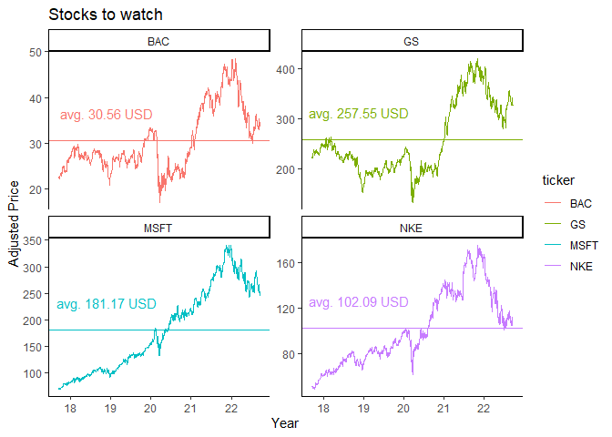
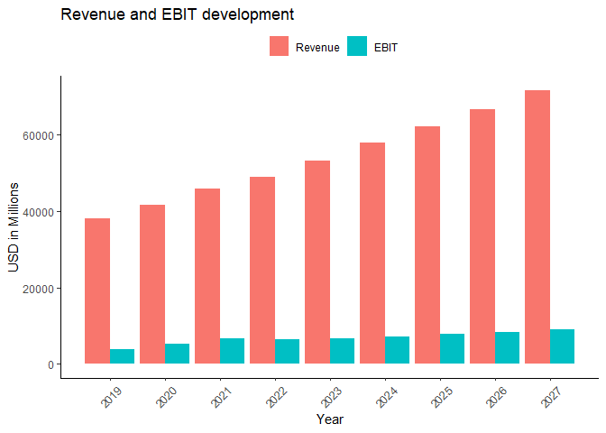
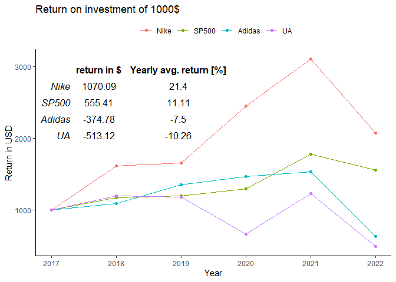
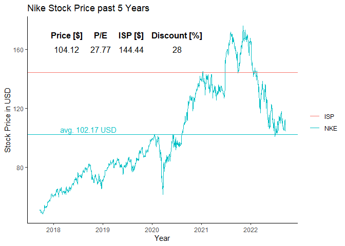

## Motivation

```{=html}
<style>
body {
text-align: justify}
</style>
```
Durch Corona und den darauffolgenden Crash an den Börsen sowie der Boom
der Neobroker kam es in den letzten Jahren zu einer stark steigenden
Zahl von Kleinanlegern an den Aktienmärkten.[@boomkleinanleger] Das Ziel
dieser Arbeit besteht darin, ein möglichst einfach zu bedienendes Tool
zu kreieren, welches mit dem Grundgedanken des value investing, den
intrinsischen Wert mittels Discounted Free Cash Flow berechnet. Dieser
implizierte Aktienpreis soll der Auswahl von Unternehmen dienen, welche
im Anschluss genauer betrachtet werden können.

## Einleitung

Im Finanzwesen spielt das Bewerten von Unternehmen eine wichtige Rolle.
Bei dem intrinsic value handelt es sich um den aktuellen wahren Wert
eines Unternehmens unter Berücksichtigung zukünftiger erwarteter
Geschäftszahlen.[@lee_myers_swaminathan_1999]

Die Ermittlung eines intrinsischen Wertes mittels DCF-Models, kann
hierbei auf zwei Arten geschehen, zum einen mit dem sogenannten free
cash flow to equity oder auch levered free cash flow und dem in dieser
Arbeit genutzten unlevered free cash flow (uFCF). Beim uFCF wird, wie
der Name sagt, kein Hebel mit einbezogen (Hebel steht hierbei für
Schulden). Aus diesem uFCF kann im Anschluss der aktuelle implizierte
Aktienpreis des Unternehmens berechnet werden.

## Unlevered Free Cash Flow Berechnung

Um den uFCF zu berechnen, müssen zunächst einige Unternehmenszahlen
projiziert werden. Zunächst wird der Mittelwert des Wachstums aus den
vergangen Revenuezahlen und den Zahlen der Analysten für die kommenden
zwei Jahre gebildet. Mit Hilfe dieses Mittelwertes werden der Revenue
weiter projiziert. Anhand des Revenues kann nun Bezug auf die
zukünftigen EBIT (earnings before interest and taxes), D&A (Depreciation
& amortization), CapEx (capital expenditure) und cNWC (change in net
working capital) Zahlen genommen werden. Hierbei berechnet sich der
uFCFwie folgt.[@firmvaluation]

$uFCF = EBIT*(1-taxrate)+DA-CapEx-cNWC$

Für die weitere Berechnung des implied share price wird die sogenannte
required rate of return benötigt (RRR), diese kann angenommen werden, da
sie den return welcher ein Asset hervorbringen soll, darstellt. Jedoch
kann diese mittels dem weigthed average cost of capital (WACC) auch
berechnet werden.[@WACC]

$WACC = r_e*(1-L)+r_d*(1-T_c)*L$ mit $r_e$: cost of equity L: leverage
ratio (Debt/Value) $r_d$: cost of debt, $T_c$: tax rate

Aus dem uFCF und der RRR kann nun der firm value berechnet
werden.[@firmvaluation]

$FirmValue = \sum_{t=1}^t \frac {uFCF_t}{(1+RRR)^t}$ mit $FCFF_t$ = Free
Cash Flow in year t

Es gilt zu beachten, dass in dieser Arbeit eine mid year conversion
angewandt wird, wodurch t in Jahren mit dem discount factor ersetzt
wird. Dies entspringt der Annahme, dass ein unternehmen konstant cash
flow generiert und somit der Fortschritt des Fiskaljahres berücksichtigt
werden muss.

$Terminalvalue = uFCF * \frac{1+TGR}{RRR-TGR}$

$pTerminalValue = \frac {{Terminalvalue_n}}{(1+RRR)^discfac}$

Der Enterprise Value ergibt sich daraufhin aus der folgenden
Formel.[@entval]

$Enterprisevalue = pTerminalvalue+Firmvalue$

Addiert man nun noch das Cash Vermögen des Unternehmens und zieht die
Schulden ab, gelangt man zum equity value

$Equityvalue = Enterprisevalue + Cash +Schulden$

Teilt man dieses durch die Aktien, welche sich im Umlauf befinden,
erhält man den implizierten Aktienpreis.

Hieraus stellt sich die Frage nach der Möglichkeit, einen Data Scraper
zu konstruieren, welcher kostenfreie Daten nutzt, um mit diesem die
nötigen Informationen zu sammeln, welche für die uFCF und die
anschließende implied share price Kalkulation benötigt werden.

## Aufbau

Zunächst wird durch die Data Scraper die Daten für die DCF und den Price
to Book value (P/B) von den zugeteilten Websites gescraped. Die Ticker
der angegebenen Unternehmen dienen als Pfad für das Extrahieren der
HTML-Texte aus den URLs. Diese HTML-Texte werden im Anschluss nach
Stichwörtern durchsucht und die Zwischenstellen extrahiert. Diese
Zwischenstellen dienen in Form von data frames als Grundlage für die
Berechnung des intrinsic values bzw. bei Banken der Berechnung des
P/B-Values. Durch die erlangten Informationen werden durch ein stock
picking potenzielle Aktien ausgewählt und eine davon für eine genauere
Untersuchung genauer betrachtet.

## Daten

Alle Daten mit der Ausnahme des country risk premiums stammen von Yahoo
Finance. Das Country Risk Premium wird der Webstte von Professor Aswath
Damodaran mit Hilfe eines HTML nodes in Form einer Tabelle entnommen und
als data frame dargestellt. Für das country risk premium nutzt Professor
Damodaran das implied equity risk premium des Aktienindexes
S&P500.[@countryriskpremium] Die Daten von Yahoo Finances werden mit
Hilfe des packages rvest in Form des gesamten bodys als Text ausgegeben.
In diesem Text sind die benötigten Zahlen und Daten wie Währung oder
Industry enhalten. Diese werden mit qdapRegex extrahiert und in Form von
data frames bis zur Berechnung gespeichert. Diese Daten werden von Yahoo
Finance erhoben und stammen aus den Berichten der Unternehmen, sind
jedoch leider in manchen Fällen unvollständig oder unterschiedlich
gelabelt.

Pro Unternehmen werden zwei Listen mit je fünf bzw. drei data frames und
einem einzelnen data frame ausgegeben. In Summe sind hierin 46
Datenpunkte enthalten. Die Umfänge der gesamten Daten unterscheiden sich
je nachdem wie viele Unternehmen untersucht werden sollen.

## Software

Das Programm wurde in RStudio mit der R-Version: 4.1.1 auf einem Laptop
(Lenovo ThinkPad T490s) angefertigt. Folgende packages wurden verwendet.

-   tidyverse[@R-tidyverse]

    -   ggplot2

    -   dplyr

    -   tibble

-   rvest[@R-rvest]

-   quantmod[@R-quantmod]

-   tidyquant[@R-tidyquant]

-   GridExtra[@R-gridExtra]

-   DiagrammeR[@R-DiagrammeR]

-   gt[@R-gt]

-   glue[@R-glue]

-   reshape2[@R-reshape2]

Bei tidyverse handelt es sich um ein package in welchem mehrere packages
enthalten sind. Hierunter fallen ggplot2 (dient der visualisierung),
dplyr (Manipulation von data frames) , tidyr (Umwandlung von data
frames), readr(lesen von data aus z. B. CSVs), purrr(erleichtert
Arbeiten mit Vektoren und Funktionen), tibble(ermöglicht data frame
anderst zu formatieren), stringr(erleichtert das Arbeiten mit strings)
und forcats(hilft bei der Kategorisierung von variablen). Es wurden
jedoch nicht alle packeges die in tidyverse enthalten sind, in dieser
Arbeit verwendet. Bei den Verwendeten handelt es sich um ggplot2, dplyr
und tibble. Zur Umwandlung des Formats von data frames wurde das package
reshape2 genutzt.

Als Kernstück der Scraper dient das package rvest, dieses ermöglicht das
Sammeln von Daten von Websites. Zur Sammlung von aktuellen Aktienkursen
wird das quantmod genutzt, während tidyquant die verbindunge zwischen
quantmod und den tidyverse packages schafft.

GridExtra ermöglicht ein schönes Einfügen von Tabellen in Plots welche
mit ggplot2 angefertigt wurden. Mit DiagrammeR lassen sich Flow Charts
erstellen und mit dem package gt ergeben sich Möglichkeiten, schöne
Tabellen zu erstellen. Mit glue können Variablen eingefügt und auch
Verbunden werden, ähnlich wie mit der paste Funktion, jedoch kürzer und
übersichtlicher bei mehreren Variablen.

## Code Aufbau

Es werden zunächst mittels HTML scraping alle nötigen Daten gesammelt.
Daraufhin werden diese in Rechenfunktionen weiter bearbeitet, um die
nötigen Werte wie WACC und Implied Share Price zu erhalten. Die
berechneten und gescraped Daten werden mittels while Schleifen an die
Ticker zugewiesen. Um den Ablauf der Zuweisung besser darzustellen,
wurde ein Flow Chart erstellt.[@flowchart]


```r
# erstellt einen flowchart für die Erklärung der Datenzuweisung
grViz("digraph flowchart {
        # graph statement

         graph [layout = dot,
         rankdir = TB,
         fontsize = 8]

  # definition der nodes mit dem substituierten label text
      node [fontname = Helvetica, shape = rectangle]        
      tab1 [label = '@@1']
      tab2 [label = '@@2']
      tab3 [label = '@@3']
      tab4 [label = '@@4']
      tab5 [label = '@@5']
      tab6 [label = '@@6']
      tab7 [label = '@@7']
      tab8 [label = '@@8']
     
      # edges
      # definiert die node und die darauffolgenden mit hilfe der node id
      tab1 -> tab2 -> tab3 -> tab4 -> tab6 ->tab8 
      tab4 -> tab7 
      tab7 -> tab5[label = 'counter + 1']
      tab5 -> tab1
}

      # die dargestellten Titel der nodes
      [1]: 'ticker'
      [2]: 'Data Scraping'
      [3]: 'Data Assignement'
      [4]: 'last row of df?'
      [5]: 'next Row'
      [6]: 'true'
      [7]: 'false' 
      [8]: 'assignement finished'
    ")
```

```{=html}
<div id="htmlwidget-3f727138d87536e18c00" style="width:672px;height:480px;" class="grViz html-widget"></div>
<script type="application/json" data-for="htmlwidget-3f727138d87536e18c00">{"x":{"diagram":"digraph flowchart {\n        # graph statement\n\n         graph [layout = dot,\n         rankdir = TB,\n         fontsize = 8]\n\n  # definition der nodes mit dem substituierten label text\n      node [fontname = Helvetica, shape = rectangle]        \n      tab1 [label = \"ticker\"]\n      tab2 [label = \"Data Scraping\"]\n      tab3 [label = \"Data Assignement\"]\n      tab4 [label = \"last row of df?\"]\n      tab5 [label = \"next Row\"]\n      tab6 [label = \"true\"]\n      tab7 [label = \"false\"]\n      tab8 [label = \"assignement finished\"]\n     \n      # edges\n      # definiert die node und die darauffolgenden mit hilfe der node id\n      tab1 -> tab2 -> tab3 -> tab4 -> tab6 ->tab8 \n      tab4 -> tab7 \n      tab7 -> tab5[label = \"counter + 1\"]\n      tab5 -> tab1\n}\n\n      # die dargestellten Titel der nodes","config":{"engine":"dot","options":null}},"evals":[],"jsHooks":[]}</script>
```

Nach der Zuweisung der Daten mittels while Schleifen werden die
vermeintlich besten Aktien "gepickt" und ausgeben. Die Bedingungen für
das picking und wie dieses abläuft, kann dem nächsten Flow Chart
entnommen werden.


```r
# erstellt einen flowchart für die bessere Übersicht, wie die Auswahl der 
# Aktienpicks stattfindet
grViz("digraph flowchart {
      # definition der nodes mit dem substituierten label text
      node [fontname = Helvetica, shape = rectangle]        
      tab1 [label = '@@1']
      tab2 [label = '@@2']
      tab3 [label = '@@3']
      tab4 [label = '@@4']
      tab5 [label = '@@5']
      tab6 [label = '@@6']
      tab7 [label = '@@7']
      tab8 [label = '@@8']
      tab9 [label = '@@9']
     
      # definiert die node und die darauffolgenden mit hilfe der node id
      tab1 -> tab2 -> tab4 -> tab5 -> tab6 -> tab7
      tab1 -> tab3 -> tab8 -> tab9 -> tab6
}
      # die dargestellten Titel der nodes
      [1]: 'Stocks'
      [2]: 'Non Financial Stocks'
      [3]: 'Financial Stocks'
      [4]: 'Price lower as DCF implied share price'
      [5]: 'Top 2 highest ISP diff to Price'
      [6]: 'Picks to watch'
      [7]: 'Deeper analysis'
      [8]: 'P/B between 0 and 1.5'
      [9]: 'Top 2 lowest P/B'
      ")
```

```{=html}
<div id="htmlwidget-f0fe7a3f886d4873c200" style="width:672px;height:480px;" class="grViz html-widget"></div>
<script type="application/json" data-for="htmlwidget-f0fe7a3f886d4873c200">{"x":{"diagram":"digraph flowchart {\n      # definition der nodes mit dem substituierten label text\n      node [fontname = Helvetica, shape = rectangle]        \n      tab1 [label = \"Stocks\"]\n      tab2 [label = \"Non Financial Stocks\"]\n      tab3 [label = \"Financial Stocks\"]\n      tab4 [label = \"Price lower as DCF implied share price\"]\n      tab5 [label = \"Top 2 highest ISP diff to Price\"]\n      tab6 [label = \"Picks to watch\"]\n      tab7 [label = \"Deeper analysis\"]\n      tab8 [label = \"P/B between 0 and 1.5\"]\n      tab9 [label = \"Top 2 lowest P/B\"]\n     \n      # definiert die node und die darauffolgenden mit hilfe der node id\n      tab1 -> tab2 -> tab4 -> tab5 -> tab6 -> tab7\n      tab1 -> tab3 -> tab8 -> tab9 -> tab6\n}\n      # die dargestellten Titel der nodes","config":{"engine":"dot","options":null}},"evals":[],"jsHooks":[]}</script>
```

Nach dem Sammeln, Berechnen und Zuweisen der Daten werden diese mit
Hilfe von ggplot2 Funktionen Graphisch dargestellt.

## Code

Der Übersicht halber wurden die selbst erstellten Funktionen gesourced
und kommen nicht im Dokument selbst vor. Zunächst werden Unternehmen
mittels ihres Yahoo Finance Tickers mittels Vektor einer Variablen
zugeteilt. Die Funktion basics_assignement, welche wiederum die Funktion
basics_data enthält, weist mittels einer while Schleife, die von den
scrapern erhaltenen Daten zu.


```r
# Die ergebnisse dieses chunks werden nicht in dem HTML Dokument ausgegeben,
# da bei vielen Tickern ein großer output entsteht

# Die Ticker der ausgesuchten Firmen, werden mittels eines Vektors der 
# Variablen Ticker zugewiesen

Ticker <-c("EOAN.DE", "GS", "MSFT", "AAPL", "BAC", "CRM", "NVDA", "NKE", "MS")


# Erstellt einen data frame aus Ticker
Stocks <- data.frame(Ticker)

# die Variable Ticker wird nicht mehr benötigt und wird entfernt
rm(Ticker)

# wendent die Funktion basics_assignment auf den data frame Stocks an, als 
# Ticker der Funktion werden die in Klammern geschriebenen Stocks genutzt
# und nutzt anschliesend nur den Teil der ausgegeben Listen, welche benötigt wird
Stocks <- basics_assignement(Stocks)
Stocks <- Stocks$list
```

Die Scraper bookv_data, basics_data und DCF_data_scraper laufen nach dem
gleichen Schema ab. Zunächst wird mittels rvest und den darin
enthaltenen Funktionen read_html, html_node und html_text der gesamte
HTML Text der URLs ausgegeben.[@scraper] Einzige Ausnahme hier ist das
Country Risk Premium, hier wird mittels html_node nicht der gesamte HTML
Text entnommen, sondern nur die auf der URL vorkommende Tabelle. Im
Anschluss wird mit Hilfe der qdapRegex Funktion die Daten aus dem HTML
Text extrahiert. Dies geschieht indem mit qdapRegex::ex_between der Text
zwischen Stichwörtern extrahiert und einer Variablen zugeordnet wird.

Das Herzstück des Programms ist die Anwendung mehrerer Funktionen und
Zuweisung der Berechneten und gescrapeten Daten. Dies geschieht wieder
mit einer while Schleife, hier kommen jedoch deutlich mehr Funktionen
zum Einsatz. Zunächst wird mit einer if else Funktion überprüft ob es
sich bei dem zu verarbeitend Ticker um eine Bank handelt, ist dies der
Fall, wird nur die Funktion bookv_data angewandt und dem implied share
price ein NA zugeteilt. In allen anderen Fällen mit Hilfe der lapply
Funktion der DCF_data_scraper auf eine Variable angewandt. Die Funktion,
DCF_calculation, nutzt im Folgenden die mit dem Scraper erstellte Liste,
um die nötigten Daten für die implied share price kalkulation zu
berechnen. Zu beachten ist, dass sich in DCF_calculation noch eine
weitere Funktion befindet, welche die Daten so umrechnet, dass sie auf
das Ende des Jahres angepasst werden. So können Unternehmen mit
unterschiedlichen Fiskaljahr Enden besser miteinander verglichen werden.
Diese calenderization Funkion wendet mit Hilfe einer while Schleifer
innerhalb einer while Schleife eine Rechnung auf den gesamten neu zu
berechnenden Datensatz an. Die Funktionen WACC_data und ISP_data dienen
der Berechnung von WACC und implied share price und mit der Zuweisung
des ISP und des P/B beginnt die Schleife von vorne, bis das Ende des
Datensatzes erreicht ist.


```r
# die Ergebnisse sind versteckt, da es das HTML Dokument unleserlich machen
# würde, die ausgaben sind für die Nutzerfreundlichkeit gedacht

# weisst der Variablen die bereits erhaltenen Unternehmens Daten zu
toassaign_df <- Stocks

# Beginn der Zählunbg der while Schleife und erstellt weitere cols für die
# kommenden Daten
  x<-1
  DCF_ISP <-"DCF_ISP"
  DCF_ISP <- data.frame(DCF_ISP)
  PB <- "P/B"
  PB <- data.frame(PB)
  toassaign_df<- bind_cols(toassaign_df, DCF_ISP)
  toassaign_df<- bind_cols(toassaign_df, PB)

# Eine while Schleife wird erstellt welche bei x anfängt zu Zählen, bis das ende
# der Reihen erreicht ist
  while (x<=nrow(toassaign_df)) {
    # weisst der Varibalen die Firma zu, damit diese ausgegeben weden kann,
    # damit der Benutzer einen Fortschritt erkennt
    company <- toassaign_df[paste(x),1]
    print(paste("checking Sector", x, "of",nrow(toassaign_df), "of", company))
    # der ticker wird für die DCF scraper Funktion zugewiesen
    ticker <- toassaign_df[paste(x),2]
    # Überpürft ob das Unternehmen der Industry Banks—Diversified oder 
    # Capital Markets angehört, da diese sich nicht für eine DCF Bewertung 
    # eignen. ISt dies nicht der Fall wird der DCF berechnet, ist dies der fall
    # wird die DCF übersprungen und nur der Price to book value zugewiesen
    check_for_fin <- isTRUE(toassaign_df[paste(x),3]=="Banks—Diversified" 
                            || toassaign_df[paste(x),3]=="Capital Markets" )
    if(check_for_fin=="FALSE"){
      print(paste("applying DCF scraper to", company))
      scraped_DCF_data <- lapply(toassaign_df$Ticker[as.numeric(paste(x))],
                                 DCF_data_scraper)
      print(paste("calculating fair value of", company))
      # wendet die DCF_calculation Funktion an
      DCF_calc_data <- DCF_calculation()
      # wendet die WACC_calculation Funktion an
      WACC_data <- WACC_calculation()
      # wendet die Funktion fpr den implied share price an
      ISP_data <- Imp_Share_Price_calculation()
      # weist dem df den implied share price zu
      toassaign_df[paste(x),7] <- ISP_data$ISP
      print(paste("applying book value scraper to", company))
      # weist dem df den book value pro Aktie zu
      toassaign_df[paste(x),8] <- bookv_data(ticker)
    }
    else {
      # Nachrricht für den Benutzer 
      print(paste("applying book value scraper to", company))
      # weist Banken ein NA in der col DCF_ISP zu und weist den P/B zu
      toassaign_df[paste(x),7] <- "NA"
      toassaign_df[paste(x),8] <- bookv_data(ticker)
    }
    x<-x+1
  }
  
# wandelt die Daten in numerische charaktere um
toassaign_df$PB <- as.numeric(toassaign_df$PB)
toassaign_df$DCF_ISP <- as.numeric(toassaign_df$DCF_ISP)  
toassaign_df$Price <- as.numeric(toassaign_df$Price)
toassaign_df$PE <- as.numeric(toassaign_df$PE)
Stocks <- toassaign_df

# entfernt alle in nicht mehr benötigten dfs und variablen
rm(DCF_calc_data,DCF_ISP,ISP_data, PB, scraped_DCF_data,toassaign_df,WACC_data,
   company, ticker, check_for_fin,x)
```

Die erhaltenen Unternehmen werden im Anschluss geordnet und die nicht
den Kriterien entsprechenden aussortiert. Aus den Unternehmen mit einem
Aktienpreis, welcher über dem ISP liegt, wird ein neuer data frame
erstellt. Mit der drop_na Funktion werden die Bankaktien entfernt, da
diese ein NA im ISP aufweisen. Der Unterschied zwischen ISP und
aktuellem Preis wird berechnet und mittels arrange Funktion werden die
Unternehmen dem Größenunterschied zwischen diesen beiden Variablen nach
geordnet. Mittels slice Funktion werden die Top 2 Aktien einem neuen
data frame zugeordnet. Die Bankunternehmen werden in einem ähnlichen
Prinzip gefiltert, jedoch werden diese mit Hilfe der Filter Funktion
einem neuen data frame zugewiesen. Die Banken mit einem P/B zwischen 0
und 1.5 werden genutzt arrangiert und die Top 2 werden wieder gesliced.
Die so ausgewählten Aktien werden in einem data frame zusammengefasst.
Mit der Funktion rownames werden die Reihen umbenannt. Die daraufhin
genutzte Funktion rename bietet eine weitere Möglichkeit der
Umbenennung(in dieser werden nur cols oder rows umbenannt, welche
explizit genannt werden).


```r
# Die Top 4 Akiten (Top 2 DCF und Top 2 P/B) werden dem data frame entommen

# welcher unter dem aktuellen Preis liegt
picks_DCF_ISP <- Stocks[Stocks$Price < Stocks$DCF_ISP,]

# entfern alle reihen mit NAs, was dazu führt, dass Banken entfernt werden
picks_DCF_ISP <- picks_DCF_ISP %>% drop_na()

# berechnet den Prozentsatz mit welcher das Unternehmen unter dem aktuellen
# Aktienkurs liegt
p_under_DCF_ISP <- (1-round(picks_DCF_ISP$Price/picks_DCF_ISP$DCF_ISP, 2))*100
p_under_DCF_ISP <- data.frame(p_under_DCF_ISP)

# erstellt einen data frame aus den Prozentsätzen und den gewählten Unternehmen
picks_DCF_ISP<- bind_cols(picks_DCF_ISP,p_under_DCF_ISP)

# sortiert den data frame absteigend nach dem größten Unterschied zum Aktienkurs
# zuerst
picks_DCF_ISP <- picks_DCF_ISP %>%
  arrange(desc(p_under_DCF_ISP))

# entfernt alles bis auf die ersten beiden Reihen   
picks_DCF_ISP <- slice(picks_DCF_ISP,1:2)


# entnimmt dem data frame Stocks alle Banken und alle Unternehmen mit einer
# P/B ration zwischen 0 und 1.5
picks_fin <- Stocks %>% filter(
  Industry == "Banks—Diversified" | Industry == "Capital Markets")
picks_fin <- picks_fin[picks_fin$PB < 1.5,]
picks_fin <- picks_fin[picks_fin$PB > 0,]

# sortiert nach P/B von niedrig nach hoch und trennt die ersten 2 Reihen ab
picks_fin <- picks_fin %>%
  arrange(PB)
picks_fin <- slice(picks_fin,1:2)

# erstellt einen kombinierten data frame der picks und entfernt die col
# der prozentsätze
picks <- data.frame(picks_DCF_ISP)
picks <- bind_rows(picks, picks_fin)
droping <- "p_under_DCF_ISP"
picks <- picks[ , !(names(picks) %in% droping)]

# da durch die umsortierung die reihen namen durcheinander gekommen sind, werden
# diese umbeannt
rownames(picks)<- c(1:nrow(picks))

# col namen werden umbenannt, würde auch wie die row namen 
# oben funktionieren, jedoch wird durch dieses verfahren eine col nur umbenannt 
# wenn diese mit ihrem Namen exisitiert
picks <- picks %>% 
    rename(
      "P/E" = PE,
      "Implied share value" = DCF_ISP,
      "P/B" = PB
    )
# entfernt alle nicht mehr benötigten Datensätze und Variablen
rm(p_under_DCF_ISP,picks_DCF_ISP,picks_fin)
```

Die zur Darstellung der Aktienkurse benötigten Daten werden mit Hilfe
des packages tidyquant extrahiert. [@findata] Durch die tq_get Funktion
werden die Preise in einem angegebenen Zeitraum der Ticker entnommen. Es
wird daraufhin der Mittelwert der adjusted Prices ermittelt und mit
summarise zusammengefasst und über group_by ein data frame erstellt der
die Ticker inklusive ihrer mittleren adjusted share prices enthält.

Mit der ggplot Funktion werden die Aktienkurse graphisch dargestellt.
Dieser Darstellung werden mittels weiterer Funktionen diverser Elemente
zusätzlich zugeordnet. Durch die geom_hline wird eine horizontale Linie
eingezeichnet. Facet wrap ermöglicht die Darstellung der sich sonst in
einem Plot zusammengefassten Aktienkurse in mehrere aufzuteilen und
geom_text, erlaubt das Einfügen von Text in den Plot.[@findata]


```r
# die durch das picking ausgewählten Unternehmen werden dem vektor ticker 
# zugewiesen
ticker <- picks$Ticker

# Zählt 5 Jahre zurück und setzt dieses Datum als Start Datum für die Graphen  
start_date <- ymd(format(Sys.Date())) - years(5)

# läd die Preis Daten im Zeitraum t - 5 Jahre und heute herunter
prices <- tq_get(ticker,
                 from = start_date,
                 to = format(Sys.Date()),
                 get = "stock.prices")

# nennt die col symbol in ticker um (da bisher so gehandhabt)
prices <- prices %>% 
    rename(
      ticker = symbol,
    )

# berechnet den Mittelwert der Preise für die ticker und fasst diese zusammen
mean_prices <- prices %>% group_by(ticker)%>%summarise(mean=mean(adjusted))

# erstellt einen data frame für die Währung in welcher die Unternehmensdaten
# veröffentlicht wurden arrangiert diese so, dass sie dem Unternehmen zugewiesen
# werden kann
curr <- picks %>% arrange(Ticker)
curr <- curr$Currency
curr <- data.frame(curr)
mean_prices <- bind_cols(mean_prices, curr)

picks_plot <- prices %>%
          ggplot(aes(x = date, y = adjusted, color = ticker)) +
          geom_line()+
          # fügt eine linie ein, welche den mittelwert abbildet
          geom_hline(data = mean_prices, aes(yintercept = mean, color = ticker))+
          # sapltet die sonst in einem diagramm dargestellten 4 Unternehmen 
          # in 4 einzelne diagramme auf
          facet_wrap(~ticker,scales = 'free_y')+
          # sauberers theme
          theme_classic()+
          # bennent den Titel und x und y Achse des Diagramms
          labs(x = 'Year',
           y = "Adjusted Price",
           title = "Stocks to watch") +
           scale_x_date(date_breaks = "year",
               date_labels = "%y")+
          # Fügt den Mittelwert incl. der Währung über der Mittelwertlinie ein
          geom_text(data = mean_prices, aes(x = prices$date[300], y = mean, 
                    label = paste("avg.", round(mean,2), curr), vjust = -2), 
                    show.legend = F)
```

Im Folgenden wird der ausgewählte Einzeltitel genauer betrachtet.
Zunächst werden die scraper und Rechenfunktion auf den Ticker
angewendet. Daraufhin wird der data frame so arrangiert und
Wachstumsraten etc. hinzugefügt, dass eine gute Darstellung der
erhaltenen Daten in einem Tabellenformat stattfinden kann. Mit der
add_column Funktion können cols eingefügt werden. Mittels gt Funktion
werden tibbles (data frames, welche mit der as_tibble Funktion
umgewandelt worden sind) als gut aussehende Tabellen dargestellt. Es
gibt diverse Funktionen, um die Zellen in der Tabelle zu bearbeiten. So
rechnet fmt_percent die Werte der Zelle in Prozent um, oder fmt_currency
weist der Zelle eine Währung. Mit tab_style können z. B. die Farben der
Zelle verändert werden.[@gttables]


```r
# Es wird ein Unternehmen ausgewählt, welches einer genaueren 
# Betrachtung unterzogen werden soll
ticker <- "NKE"
Ticker <- data.frame(ticker)

# Da die Daten im ersten scraping durchgang nicht einheitlich sind, da Zeit
# bei den Banken gespart werden soll, müssen hier die Geschäftszahlen 
# erneut gescraped und die Berechnungen angewand werden
Stock <- basics_assignement(Ticker)
scraped_DCF_data <- lapply(ticker, DCF_data_scraper)
DCF_calc_data <- DCF_calculation()
WACC_data <- WACC_calculation()

# ermöglicht kürzere variablen namen für den zugriff auf Daten
attach(DCF_calc_data$calended_data)

DCF_data_CYE <- data.frame(DCF_calc_data$calended_data[2:9])
# stellt alle Daten in Millionen $ dar
DCF_data_CYE <- round(DCF_data_CYE[1:8]/1000000)
# Wachstunmsrate des Revnues
p_growth_Rev <- c("-", (TotalRevenue[2:9]/TotalRevenue[1:8]-1))
# Fügt die col nach der col mit dem namen TotalRevenue ein
DCF_data_CYE <- add_column(DCF_data_CYE, p_growth_Rev = p_growth_Rev,
                           .after = "TotalRevenue")
# Berechnet den Operating Margin
Operating_Margin <- EBIT[1:9]/TotalRevenue[1:9]
DCF_data_CYE <- add_column(DCF_data_CYE, Operating_Margin = Operating_Margin,
                           .after = "EBIT")
# Anteil der Steuern am EBIT
p_of_EBIT <- IncTaxEx[1:9]/EBIT[1:9]
DCF_data_CYE <- add_column(DCF_data_CYE, p_of_EBIT = p_of_EBIT,
                           .after = "IncTaxEx")
# Anteil der D&A am Revenue
DandA_p_of_Rev <- DandA[1:9]/TotalRevenue[1:9]
DCF_data_CYE <- add_column(DCF_data_CYE, DandA_p_of_Rev = DandA_p_of_Rev,
                           .after = "DandA")
# Anteil der CapEx am Revenue
CapEx_p_of_Rev <- CAPEX[1:9]/TotalRevenue[1:9]
DCF_data_CYE <- add_column(DCF_data_CYE, CapEx_p_of_Rev = CapEx_p_of_Rev,
                           .after = "CAPEX")
# Anteil der change in NWC am Revenue
cNWC_p_of_Rev <- cNWC[1:9]/TotalRevenue[1:9]
DCF_data_CYE <- add_column(DCF_data_CYE, cNWC_p_of_Rev = cNWC_p_of_Rev,
                           .after = "cNWC")
# Wachstumsrate des FCF
p_growth_FCF <- c("-", (FCF[2:9]/FCF[1:8]-1))
DCF_data_CYE <- add_column(DCF_data_CYE, p_growth_FCF = p_growth_FCF,
                           .after = "FCF")
# Present value of FCF
pres_val_of_FCF <- c(rep(NA,4),round((FCF[5:9]/
              (1+WACC_data$T0_cal$RRR)^as.numeric(DiscountYear[5:9])/1000000)))
pres_val_of_FCF <- data.frame(pres_val_of_FCF)
DCF_data_CYE <- bind_cols(DCF_data_CYE,pres_val_of_FCF)
# detach die Daten wieder, damit keine Maskierung entstht
detach(DCF_calc_data$calended_data)

# entfernt die ersten beiden Reihen
DCF_data_CYE <- DCF_data_CYE[3:9,]
# wandelt nicht numerische charaktere in numerische um
DCF_data_CYE$p_growth_Rev <- as.numeric(DCF_data_CYE$p_growth_Rev)
DCF_data_CYE$p_growth_FCF <- as.numeric(DCF_data_CYE$p_growth_FCF)
# dreht tabelle, damit die col jetzt rows sind
DCF_data_CYE <- t(DCF_data_CYE)

# erstellt einen dataframe für die Jahre 
Year <- DCF_calc_data$calended_data$Year[3:4]
Year <- c(Year, paste0(Year[2]+1, "E"), paste0(Year[2]+2, "E"),
          paste0(Year[2]+3, "E"), paste0(Year[2]+4, "E"), paste0(Year[2]+5, "E"))
colnames(DCF_data_CYE) <- Year

# erstellt den Vektor Year mit den gewünschten Namen der Rows
Year <- c("Revenue","growth y-o-y", "EBIT", "Operating margin", 
                             "Taxes","% of EBIT", "D&A", "% of revenue", "CapEx",
                             "% of revenue", "Change in NWC", "% of revenue",
                             "EBIAT", "uFCF", "growth y-o-y",  "Present value of FCF" )

# wandelt den data frame in einen tibble um, dieser kann mit dem gt packege als 
# schöne tabellen dargestellt werden und fügt die col Year am beginn des tibble
# ein
DCF_data_CYE <- as_tibble(DCF_data_CYE)
DCF_data_CYE <- DCF_data_CYE %>% add_column(Year, .before = "2021")

# erstellt aus dem tibble eine Tabelle
DCF_table_CYE <- gt(DCF_data_CYE)

# veränderungen an der Tabelle
DCF_table_CYE <- 
  DCF_table_CYE %>%
  # gibt der Tabelle einen Titel und Untertitel, mit glue können Variablen 
  # eingefügt werden, ähnlich wie mit paste, jedoch kürzer bei mehreren, hier
  # eventuell unnötig
  tab_header(
    title = glue("{Stock$list$Company} Discounted Cash Flow"),
    subtitle = glue("{Stock$list$Currency} in millions")
  ) %>%
  # wandelt die Daten in den cols und rows in % um und rundet diese auf eine
  # Nachkommastelle
  fmt_percent(
    columns = c(2:8),
    rows = c(2,4,6,8,10,12,15),
    decimals = 1
  ) %>%
  # Fügt den Daten in den cols und rows ein $ hinzu und rundet diese auf 0
  # Nachkommastelle
    fmt_currency(
    columns = c(2:8),
    rows = c(1,3,5,7,9,11,13,14,16),
    currency = "USD",
    decimals = 0
    ) %>% 
  # erlaubt das Färben von Zellen 
  tab_style(
    style = list(
      cell_fill(color = "deepskyblue2")
    ),
    # Fräbt Zellen in den angegeben cols und rows
    locations = cells_body(
      columns = c(2:8),
      rows = 14)
  ) %>%
  tab_style(
    style = list(
      cell_fill(color = "deepskyblue2")
    ),
    # Fräbt Zellen in den angegeben cols und rows
    locations = cells_body(
      columns = c(4:8), 
      rows = 16)
)
rm(Year,start_date,p_of_EBIT,p_growth_Rev,p_growth_FCF,Operating_Margin,droping,
   DandA_p_of_Rev,cNWC_p_of_Rev,CapEx_p_of_Rev, ticker)
DCF_table_CYE
```


```r
# Berechnet die ISP daten
ISP_data <- Imp_Share_Price_calculation()

attach(ISP_data)
attach(scraped_DCF_data[[1]]$T0Data)
attach(Stock$list)
# berechnet den Discount zwischen Preis und ISP
Discount <- 1-as.numeric(Price)/ISP
Discount <- data.frame(Discount)
PTermValue <- data.frame(PTermValue)
EntpriVal <- data.frame(EntpriVal)
EquValue <- data.frame(EquValue)
floatshares <- data.frame(floatshares)
ISP <- data.frame(ISP[1])
Price <- data.frame(Price)
Tot_PV_p_FCF <- sum(as.numeric(PUnlevFCF))
Tot_PV_p_FCF <- data.frame(Tot_PV_p_FCF)
detach(ISP_data)
detach(scraped_DCF_data[[1]]$T0Data)
detach(Stock$list)

# Berechnet den summierten present value des FCF

PPS_data <- bind_cols(Tot_PV_p_FCF,PTermValue,EntpriVal,EquValue,
                      floatshares, ISP, Price, Discount )

PPS_data$Price <- as.numeric(PPS_data[7])
# Stellt die Zahlen in millionen dar
PPS_data[1:5] <- round(PPS_data[1:5]/1000000)
# dreht die den data frame 
PPS_data <- t(PPS_data)
# weist der Varibalen das aktuelle Jahr zu(ohne Monat und Tag)
curYear <- format(Sys.Date())
curYear <- year(curYear)

colnames(PPS_data) <- curYear
Year <- c("Total PV of proj. FCF", "PV Terminal VAlue", "Enterprise Value",
          "Equity Value", "Shares outstanding", "Implied Share Price", 
          "Current Share Price", "Discount")

# erstellt einen tibble und erweitert den data frame um das aktuelle Jahr
PPS_data <- as_tibble(PPS_data)
PPS_data <- PPS_data %>% add_column(Year, .before = "2022")

# erstellt mit gt eine schöne Tabelle
PPS_table <- gt(PPS_data)

# Veränderungen an der Tabelle
PPS_table <- 
  PPS_table %>%
  tab_header(
    # erstellt einen Titel und Untetitel
    title = "Price per Share",
    subtitle = glue("Numbers in millions, unless otherwise stated")
  ) %>%
  # stellt die Zahlen der Zellen in Prozent mit einer Nachkommastelle dar
  fmt_percent(
    columns = `2022`,
    rows = 8,
    decimals = 1
  ) %>%
  # weist den Zahlen der Zellen ein Dollarzeichen zu
    fmt_currency(
    columns = `2022`,
    rows = c(1,2,3,4,6,7),
    currency = "USD",
    decimals = 0
    )  %>%
  tab_footnote(
    # weist den Zahlen der Zellen eine Fußnote zu
    footnote = "not in millions",
    locations = cells_body(
    columns = 1, 
    rows = 6:8)
  ) %>%
  # fräbt die Zelle ein
tab_style(
    style = list(
      cell_fill(color = "deepskyblue2")
    ),
    locations = cells_body(
      columns = c(2),
      rows = 6)
)

rm(curYear, Discount, Tot_PV_p_FCF)
```

Nach der Erstellung der Tabellen werden unterschiedliche Plots für die
explorative Analyse des Einzeltitels angefertigt. Ein Säulendiagramm
wird mit der ggplot2 Funktion geom_ba erstellt. Dieser Plot kann
wiederum durch weitere Funktion angepasst werden. So wird mit der
Funktion ggtitle der Diagrammtitel verändert und mit der Funktion theme
können unter anderem der Winkel der Achsenbeschriftung oder die Legende
angepasst werden. Die melt Funktion des reshape2 packages ermöglicht es
den data frame vom wide zum long Format zu "verschmelzen"., wodurch ein
einfacheres plotten als bar graph ermöglicht wird.


```r
# erstellt einen data frame für die graphische Projektion des EBIT und Revenues
bar_graph_data <- bind_cols(DCF_calc_data$calended_data[1],
                            round(DCF_calc_data$calended_data[2:3]/1000000))
colnames(bar_graph_data) <- c("Year","Revenue","EBIT")

# mithilfe der melt funktion wird der data frame so verschmolzen, das sich dieser
# besser für die darstellung eines bar graphs eignet, die id sind hier die Jahre
# und das Total Revenue und Ebit werden in einer col dargestellt
mel_bar_data <- reshape2::melt(bar_graph_data, id.var = "Year")

# erstellt einen bar graph 
bar_graph_rev_EBIT  <- ggplot(mel_bar_data, aes(x=Year, y=value,
                                                fill = variable)) + 
  geom_bar(stat = "identity", position = "dodge")+
  # classic theme für schönere Darstellung
  theme_classic()+
  # verschiebt die Legenede oberhalb des Graphens und entfernt den Legenden Namen
  theme(legend.position="top",
        legend.title=element_blank())+
  # ändert den y-Achsen Titel
  ylab("USD in Millions")+
  # passt die Beschriftung der x-Achse an und dreht diese um 45°
  theme(axis.text.x = element_text(angle = 45, vjust = 0.5))+
  # hiermit wird die x_Achsen Beschriftung konstant angezeigt wie sie im
  # data frame enthalten ist
  scale_x_continuous("Year", labels = as.character(bar_graph_data$Year),
                     breaks = bar_graph_data$Year)+
# Fügt dem Graphen einen Titel hinzu
 ggtitle("Revenue and EBIT development")
```

Für einen Vergleich mit Konkurrenzunternehmen und dem S&P500 werden die
letzten 5 berechnet und über tq_get die Preise der Ticker ausgegeben.
Aus dem data frame werden die Jahresdaten, welche mit den berechneten
Daten der vergangenen 5 Jahre übereinstimmen, entnommen und einem neuen
data frame hinzugefügt. So kann der durchschnittliche Return der letzten
5 Jahre ausgehend von 1000 € berechnet werden. Mittels annotation_custom
lässt sich über tableGrob eine der data frame der returns als Tabelle in
den Plot einfügen.[@grob]


```r
# Vergleich von Nike mit dem SP500 und zwei Wettbewerbern
ticker <- c("NKE", "^GSPC","ADDYY", "UA" )

# Zählt 5 Jahre zurück  
start_date <- ymd(format(Sys.Date())) - years(5)

# erstellt ein Datum für jedes Jahr der letzten 5 Jahre bis Heute
start_date <- start_date + days(3)
year1 <- start_date + years(1) 
year2 <- start_date + years(2) 
year3 <- start_date + years(3) + days(3)
year4 <- start_date + years(4) + days(3)
lastdate <- ymd(format(Sys.Date())) - days(2)

# entnimmt die Preise für die eingefügten Ticker (incl. Volumen)
prices <- tq_get(ticker,
                 from = start_date,
                 to = format(Sys.Date()),
                 get = "stock.prices")

# ändert den col Namen symbol zu ticker
prices <- prices %>% 
    rename(
      ticker = symbol,
    )
# erstellt einen data frame mit den Preisen der letzten 5 Jahr eim Jahresabstand
# Achtung fehleranfällig wenn das das Datum nicht im df prices vorkommt
return_rate_d <- prices[prices$date == start_date, ]
return_rate_d <- bind_rows(return_rate_d, prices[prices$date == year1, ], 
               prices[prices$date == year2, ], 
               prices[prices$date == year3, ],
               prices[prices$date == year4, ],
               prices[prices$date == lastdate, ])

# berechnet mit den Preisen des df return_rate_ddie return rate 
# für die Unternehmen
return_rate_NKE <- return_rate_d[return_rate_d$ticker == "NKE", ]
return_rate_NKE <- (return_rate_NKE$adjusted[2:6]-
                    return_rate_NKE$adjusted[1:5])/return_rate_NKE$adjusted[1:5]

return_rate_SP500 <- return_rate_d[return_rate_d$ticker == "^GSPC", ]
return_rate_SP500 <- (return_rate_SP500$adjusted[2:6]-
                return_rate_SP500$adjusted[1:5])/return_rate_SP500$adjusted[1:5]

return_rate_adi <- return_rate_d[return_rate_d$ticker == "ADDYY", ]
return_rate_adi <- (return_rate_adi$adjusted[2:6]-
                    return_rate_adi$adjusted[1:5])/return_rate_adi$adjusted[1:5]

return_rate_ua <- return_rate_d[return_rate_d$ticker == "UA", ]
return_rate_ua <- (return_rate_ua$adjusted[2:6]-
                     return_rate_ua$adjusted[1:5])/return_rate_ua$adjusted[1:5]
# die Variable x stellt den eingestzten Wert ein, um das Wachstum der Unternehmen
# und SP500 zu vergleichen
x <- 1000

# Berechnet den Return der Unternehmen und des SP500 mit einem Startwert von
# 1000 $
m_return_NKE <- c(x, x*return_rate_NKE[1]+x, (x*return_rate_NKE[1]+x)*return_rate_NKE[2]+(x*return_rate_NKE[1]+x))
m_return_NKE <- c(m_return_NKE, m_return_NKE[3]*return_rate_NKE[3]+m_return_NKE[3])
m_return_NKE <- c(m_return_NKE, m_return_NKE[4]*return_rate_NKE[4]+m_return_NKE[4])
m_return_NKE <- c(m_return_NKE, m_return_NKE[5]*return_rate_NKE[5]+m_return_NKE[5])
m_return_NKE <- data.frame(m_return_NKE)

m_return_SP500 <- c(x, x*return_rate_SP500[1]+x, (x*return_rate_SP500[1]+x)*return_rate_SP500[2]+(x*return_rate_SP500[1]+x))
m_return_SP500 <- c(m_return_SP500, m_return_SP500[3]*return_rate_SP500[3]+m_return_SP500[3])
m_return_SP500 <- c(m_return_SP500, m_return_SP500[4]*return_rate_SP500[4]+m_return_SP500[4])
m_return_SP500 <- c(m_return_SP500, m_return_SP500[5]*return_rate_SP500[5]+m_return_SP500[5])
m_return_SP500 <- data.frame(m_return_SP500)

m_return_adi <- c(x, x*return_rate_adi[1]+x, (x*return_rate_adi[1]+x)*return_rate_adi[2]+(x*return_rate_adi[1]+x))
m_return_adi <- c(m_return_adi, m_return_adi[3]*return_rate_adi[3]+m_return_adi[3])
m_return_adi <- c(m_return_adi, m_return_adi[4]*return_rate_adi[4]+m_return_adi[4])
m_return_adi <- c(m_return_adi, m_return_adi[5]*return_rate_adi[5]+m_return_adi[5])
m_return_adi <- data.frame(m_return_adi)

m_return_ua <- c(x, x*return_rate_ua[1]+x, (x*return_rate_ua[1]+x)*return_rate_ua[2]+(x*return_rate_ua[1]+x))
m_return_ua <- c(m_return_ua, m_return_ua[3]*return_rate_ua[3]+m_return_ua[3])
m_return_ua <- c(m_return_ua, m_return_ua[4]*return_rate_ua[4]+m_return_ua[4])
m_return_ua <- c(m_return_ua, m_return_ua[5]*return_rate_ua[5]+m_return_ua[5])
m_return_ua <- data.frame(m_return_ua)

Year <- year(c(start_date,year1,year2,year3,year4,lastdate))
Year <- data.frame(Year)

# erstellt einen df aus den variablen der returns, kurzzeitig ungünstige col
# namen
return_df <- bind_cols(Year, m_return_NKE, m_return_SP500, m_return_adi, m_return_ua)

return_df <- return_df %>% 
    rename(
      Nike = m_return_NKE,
      SP500 = m_return_SP500,
      Adidas = m_return_adi,
      UA = m_return_ua
    )

# wandelt den df um
mel_return_df <- reshape2::melt(return_df, id.var = "Year")
mel_return_df$value <- round(mel_return_df$value)

# entnimmt dem df nur die Werte des aktuellen Jahres und zieht das
# eingesetzte Investment ab
return_to_date <- return_df[return_df$Year == "2022", ]
return_to_date <- return_to_date[2:5]-1000

# Berechnet den Jährlichen Return über die letzten 5 Jahre
avg_RR <- ((return_to_date[1:4]/1000*100)/5)

return_to_date <- bind_rows(return_to_date,avg_RR)
# dreht die Tabelle durch verschieben der cols zu rows 
return_to_date <- t(round(return_to_date,2))

colnames(return_to_date) <- c("return in $","Yearly avg. return [%]")

# weißt der variable ein das minimal theme zu, damit dieses im folgenden graphen
# auf die in den Graphen eingefügte Tabelle angewandt werden kann, was die Optik
# verbessert
tt2 <- ttheme_minimal()
# erstellt ein Diagramm für das return auf ein investment von 1000 $
return_plot <- mel_return_df %>%
          ggplot(aes(x = Year, y = value, color = variable)) +
          # Liniendiagramm
          geom_line()+
          # zusätzlich Punkte zu besseren veranschaulichung der Daten
          geom_point()+#
          theme_classic()+
          theme(legend.position="top",
          legend.title=element_blank())+
          labs(x = 'Year',
           y = "Return in USD",
           title = "Return on investment of 1000$")+
        # fügt den df return_to_date mit dem theme tt2 in den plot ein
        annotation_custom(tableGrob(return_to_date, theme = tt2),
                    xmin=2018.2, xmax=2018.3, ymin=2000, ymax=3000)
```


```r
# Erstellen eines PLots nur für Nike und einfügen der Kerndaten
ticker <- "NKE"

# entnimmt die Preise für die eingefügten Ticker (incl. Volumen)
prices <- tq_get(ticker,
                 from = start_date,
                 to = format(Sys.Date()),
                 get = "stock.prices")

# ändert den col Namen symbol zu ticker
prices <- prices %>% 
    rename(
      ticker = symbol,
    )
# durschnittlicher Aktienkurs der letzten 5 Jahre von Nike
mean_NKE_price <- round(mean(prices$adjusted),2)
mean_NKE_price <- data.frame(mean_NKE_price)

# Fügt Kerndaten zu einem df zusammen
Stock_info <- c(Stock$list[5],Stock$list[6],
                        PPS_data$`2022`[6], round(PPS_data$`2022`[8]*100))
Stock_info <- data.frame(Stock_info)

colnames(Stock_info) <- c("Price [$]", "P/E", "ISP","Discount [%]" )

# erstellt einen plot für den ticker in welchem Kerndaten enthalten sind
# sowie der Aktienkurs der ltezten 5 Jahre
ticker_plot <- prices %>%
          ggplot(aes(x = date, y = adjusted, color = ticker)) +
          geom_line()+
          # fügt den Mittelwert in Form einer Linie ein
          geom_hline(data = mean_NKE_price, aes(yintercept = mean_NKE_price,
                                                color = ticker))+
          # fügt den Implied Share Price in Form einer Linie ein
          geom_hline(data = Stock_info, aes(yintercept = ISP, colour = "ISP"),
                                                show.legend = F)+
          theme_classic()+
          labs(x = 'Year',
           y = "Stock Price in USD",
           title = "Nike Stock Price past 5 Years")+
          # fügt den Linien ober die dazugehörende Werten hinzu
          geom_text(data = mean_NKE_price, aes(x = prices$date[250],
                                              y = mean_NKE_price, 
                                              label = paste("avg.",
                                            mean_NKE_price, Stock$list$Currency), 
                                            vjust = -0.3), show.legend = F)+
          theme(legend.position="right",
          legend.title=element_blank())

# entfernt optisch den Reihennamen damit die Tabelle besser im Plot aussieht
rownames(Stock_info) <- ""

# ändert die col Namen, da col 3 und 4 als der aktuelle ISP bzw PE angezeigt werden
colnames(Stock_info) <- c("Price [$]", "P/E", "ISP [$]","Discount [%]" )

# fügt den df Stock_Info mit dem theme tt2 in den plot ein
ticker_plot <- ticker_plot +
  annotation_custom(tableGrob(Stock_info, theme = tt2), xmin=prices$date[400], 
                    xmax=prices$date[450], ymin=160, ymax=170)
rm(tt2,Year,curr)
```

## Auswertung

Das Programm zur Auswertung von 9 Unternehmen inklusive der graphischen
Darstellung der Einzelaktien Analyse benötigt eine Laufzeit von 4
Minuten und 48 Sekunden. Ohne die Einzelaktie werden 4 Minuten und 6
Sekunden gebraucht.

Nach Betrachtung der graphischen Darstellung Stocks to watch, sowie der
Differenzen der ISP zum aktuellen Aktienkurs wurde sich unter anderem
auch wegen der nahenden eventuellen Rezession für das Unternehmen Nike
zur genaueren Analyse entschieden. Da Nike Konsumgüter produziert und
dieser Sektor durch Rezessionsängste eventuell unterbewertet sein
könnte, hat das Unternehmen, welches gute Zahlen vorweisen kann, das
potenzial, in den kommenden Jahren ein starkes Wachstum vorzulegen.


```r
print(picks_plot)
```

<!-- -->

In der Discounted Cash Flow Tabelle von Nike Inc, werden die
Projizierten Unternehmenszahlen der kommenden Jahre dargestellt wurden.
Anhand dieser Zahlen ist erkennen, dass es Nike, sofern es keinen allzu
starken Einbruch im Revenue geben wird, möglich sein sollte den Umsatz
weiter zu steigern.


```r
DCF_table_CYE
```

```{=html}
<div id="ywdtmuurvf" style="overflow-x:auto;overflow-y:auto;width:auto;height:auto;">
<style>html {
  font-family: -apple-system, BlinkMacSystemFont, 'Segoe UI', Roboto, Oxygen, Ubuntu, Cantarell, 'Helvetica Neue', 'Fira Sans', 'Droid Sans', Arial, sans-serif;
}

#ywdtmuurvf .gt_table {
  display: table;
  border-collapse: collapse;
  margin-left: auto;
  margin-right: auto;
  color: #333333;
  font-size: 16px;
  font-weight: normal;
  font-style: normal;
  background-color: #FFFFFF;
  width: auto;
  border-top-style: solid;
  border-top-width: 2px;
  border-top-color: #A8A8A8;
  border-right-style: none;
  border-right-width: 2px;
  border-right-color: #D3D3D3;
  border-bottom-style: solid;
  border-bottom-width: 2px;
  border-bottom-color: #A8A8A8;
  border-left-style: none;
  border-left-width: 2px;
  border-left-color: #D3D3D3;
}

#ywdtmuurvf .gt_heading {
  background-color: #FFFFFF;
  text-align: center;
  border-bottom-color: #FFFFFF;
  border-left-style: none;
  border-left-width: 1px;
  border-left-color: #D3D3D3;
  border-right-style: none;
  border-right-width: 1px;
  border-right-color: #D3D3D3;
}

#ywdtmuurvf .gt_title {
  color: #333333;
  font-size: 125%;
  font-weight: initial;
  padding-top: 4px;
  padding-bottom: 4px;
  padding-left: 5px;
  padding-right: 5px;
  border-bottom-color: #FFFFFF;
  border-bottom-width: 0;
}

#ywdtmuurvf .gt_subtitle {
  color: #333333;
  font-size: 85%;
  font-weight: initial;
  padding-top: 0;
  padding-bottom: 6px;
  padding-left: 5px;
  padding-right: 5px;
  border-top-color: #FFFFFF;
  border-top-width: 0;
}

#ywdtmuurvf .gt_bottom_border {
  border-bottom-style: solid;
  border-bottom-width: 2px;
  border-bottom-color: #D3D3D3;
}

#ywdtmuurvf .gt_col_headings {
  border-top-style: solid;
  border-top-width: 2px;
  border-top-color: #D3D3D3;
  border-bottom-style: solid;
  border-bottom-width: 2px;
  border-bottom-color: #D3D3D3;
  border-left-style: none;
  border-left-width: 1px;
  border-left-color: #D3D3D3;
  border-right-style: none;
  border-right-width: 1px;
  border-right-color: #D3D3D3;
}

#ywdtmuurvf .gt_col_heading {
  color: #333333;
  background-color: #FFFFFF;
  font-size: 100%;
  font-weight: normal;
  text-transform: inherit;
  border-left-style: none;
  border-left-width: 1px;
  border-left-color: #D3D3D3;
  border-right-style: none;
  border-right-width: 1px;
  border-right-color: #D3D3D3;
  vertical-align: bottom;
  padding-top: 5px;
  padding-bottom: 6px;
  padding-left: 5px;
  padding-right: 5px;
  overflow-x: hidden;
}

#ywdtmuurvf .gt_column_spanner_outer {
  color: #333333;
  background-color: #FFFFFF;
  font-size: 100%;
  font-weight: normal;
  text-transform: inherit;
  padding-top: 0;
  padding-bottom: 0;
  padding-left: 4px;
  padding-right: 4px;
}

#ywdtmuurvf .gt_column_spanner_outer:first-child {
  padding-left: 0;
}

#ywdtmuurvf .gt_column_spanner_outer:last-child {
  padding-right: 0;
}

#ywdtmuurvf .gt_column_spanner {
  border-bottom-style: solid;
  border-bottom-width: 2px;
  border-bottom-color: #D3D3D3;
  vertical-align: bottom;
  padding-top: 5px;
  padding-bottom: 5px;
  overflow-x: hidden;
  display: inline-block;
  width: 100%;
}

#ywdtmuurvf .gt_group_heading {
  padding-top: 8px;
  padding-bottom: 8px;
  padding-left: 5px;
  padding-right: 5px;
  color: #333333;
  background-color: #FFFFFF;
  font-size: 100%;
  font-weight: initial;
  text-transform: inherit;
  border-top-style: solid;
  border-top-width: 2px;
  border-top-color: #D3D3D3;
  border-bottom-style: solid;
  border-bottom-width: 2px;
  border-bottom-color: #D3D3D3;
  border-left-style: none;
  border-left-width: 1px;
  border-left-color: #D3D3D3;
  border-right-style: none;
  border-right-width: 1px;
  border-right-color: #D3D3D3;
  vertical-align: middle;
}

#ywdtmuurvf .gt_empty_group_heading {
  padding: 0.5px;
  color: #333333;
  background-color: #FFFFFF;
  font-size: 100%;
  font-weight: initial;
  border-top-style: solid;
  border-top-width: 2px;
  border-top-color: #D3D3D3;
  border-bottom-style: solid;
  border-bottom-width: 2px;
  border-bottom-color: #D3D3D3;
  vertical-align: middle;
}

#ywdtmuurvf .gt_from_md > :first-child {
  margin-top: 0;
}

#ywdtmuurvf .gt_from_md > :last-child {
  margin-bottom: 0;
}

#ywdtmuurvf .gt_row {
  padding-top: 8px;
  padding-bottom: 8px;
  padding-left: 5px;
  padding-right: 5px;
  margin: 10px;
  border-top-style: solid;
  border-top-width: 1px;
  border-top-color: #D3D3D3;
  border-left-style: none;
  border-left-width: 1px;
  border-left-color: #D3D3D3;
  border-right-style: none;
  border-right-width: 1px;
  border-right-color: #D3D3D3;
  vertical-align: middle;
  overflow-x: hidden;
}

#ywdtmuurvf .gt_stub {
  color: #333333;
  background-color: #FFFFFF;
  font-size: 100%;
  font-weight: initial;
  text-transform: inherit;
  border-right-style: solid;
  border-right-width: 2px;
  border-right-color: #D3D3D3;
  padding-left: 5px;
  padding-right: 5px;
}

#ywdtmuurvf .gt_stub_row_group {
  color: #333333;
  background-color: #FFFFFF;
  font-size: 100%;
  font-weight: initial;
  text-transform: inherit;
  border-right-style: solid;
  border-right-width: 2px;
  border-right-color: #D3D3D3;
  padding-left: 5px;
  padding-right: 5px;
  vertical-align: top;
}

#ywdtmuurvf .gt_row_group_first td {
  border-top-width: 2px;
}

#ywdtmuurvf .gt_summary_row {
  color: #333333;
  background-color: #FFFFFF;
  text-transform: inherit;
  padding-top: 8px;
  padding-bottom: 8px;
  padding-left: 5px;
  padding-right: 5px;
}

#ywdtmuurvf .gt_first_summary_row {
  border-top-style: solid;
  border-top-color: #D3D3D3;
}

#ywdtmuurvf .gt_first_summary_row.thick {
  border-top-width: 2px;
}

#ywdtmuurvf .gt_last_summary_row {
  padding-top: 8px;
  padding-bottom: 8px;
  padding-left: 5px;
  padding-right: 5px;
  border-bottom-style: solid;
  border-bottom-width: 2px;
  border-bottom-color: #D3D3D3;
}

#ywdtmuurvf .gt_grand_summary_row {
  color: #333333;
  background-color: #FFFFFF;
  text-transform: inherit;
  padding-top: 8px;
  padding-bottom: 8px;
  padding-left: 5px;
  padding-right: 5px;
}

#ywdtmuurvf .gt_first_grand_summary_row {
  padding-top: 8px;
  padding-bottom: 8px;
  padding-left: 5px;
  padding-right: 5px;
  border-top-style: double;
  border-top-width: 6px;
  border-top-color: #D3D3D3;
}

#ywdtmuurvf .gt_striped {
  background-color: rgba(128, 128, 128, 0.05);
}

#ywdtmuurvf .gt_table_body {
  border-top-style: solid;
  border-top-width: 2px;
  border-top-color: #D3D3D3;
  border-bottom-style: solid;
  border-bottom-width: 2px;
  border-bottom-color: #D3D3D3;
}

#ywdtmuurvf .gt_footnotes {
  color: #333333;
  background-color: #FFFFFF;
  border-bottom-style: none;
  border-bottom-width: 2px;
  border-bottom-color: #D3D3D3;
  border-left-style: none;
  border-left-width: 2px;
  border-left-color: #D3D3D3;
  border-right-style: none;
  border-right-width: 2px;
  border-right-color: #D3D3D3;
}

#ywdtmuurvf .gt_footnote {
  margin: 0px;
  font-size: 90%;
  padding-left: 4px;
  padding-right: 4px;
  padding-left: 5px;
  padding-right: 5px;
}

#ywdtmuurvf .gt_sourcenotes {
  color: #333333;
  background-color: #FFFFFF;
  border-bottom-style: none;
  border-bottom-width: 2px;
  border-bottom-color: #D3D3D3;
  border-left-style: none;
  border-left-width: 2px;
  border-left-color: #D3D3D3;
  border-right-style: none;
  border-right-width: 2px;
  border-right-color: #D3D3D3;
}

#ywdtmuurvf .gt_sourcenote {
  font-size: 90%;
  padding-top: 4px;
  padding-bottom: 4px;
  padding-left: 5px;
  padding-right: 5px;
}

#ywdtmuurvf .gt_left {
  text-align: left;
}

#ywdtmuurvf .gt_center {
  text-align: center;
}

#ywdtmuurvf .gt_right {
  text-align: right;
  font-variant-numeric: tabular-nums;
}

#ywdtmuurvf .gt_font_normal {
  font-weight: normal;
}

#ywdtmuurvf .gt_font_bold {
  font-weight: bold;
}

#ywdtmuurvf .gt_font_italic {
  font-style: italic;
}

#ywdtmuurvf .gt_super {
  font-size: 65%;
}

#ywdtmuurvf .gt_footnote_marks {
  font-style: italic;
  font-weight: normal;
  font-size: 75%;
  vertical-align: 0.4em;
}

#ywdtmuurvf .gt_asterisk {
  font-size: 100%;
  vertical-align: 0;
}

#ywdtmuurvf .gt_indent_1 {
  text-indent: 5px;
}

#ywdtmuurvf .gt_indent_2 {
  text-indent: 10px;
}

#ywdtmuurvf .gt_indent_3 {
  text-indent: 15px;
}

#ywdtmuurvf .gt_indent_4 {
  text-indent: 20px;
}

#ywdtmuurvf .gt_indent_5 {
  text-indent: 25px;
}
</style>
<table class="gt_table">
  <thead class="gt_header">
    <tr>
      <td colspan="8" class="gt_heading gt_title gt_font_normal" style>NIKE, Inc. Discounted Cash Flow</td>
    </tr>
    <tr>
      <td colspan="8" class="gt_heading gt_subtitle gt_font_normal gt_bottom_border" style>USD in millions</td>
    </tr>
  </thead>
  <thead class="gt_col_headings">
    <tr>
      <th class="gt_col_heading gt_columns_bottom_border gt_left" rowspan="1" colspan="1" scope="col">Year</th>
      <th class="gt_col_heading gt_columns_bottom_border gt_right" rowspan="1" colspan="1" scope="col">2021</th>
      <th class="gt_col_heading gt_columns_bottom_border gt_right" rowspan="1" colspan="1" scope="col">2022</th>
      <th class="gt_col_heading gt_columns_bottom_border gt_right" rowspan="1" colspan="1" scope="col">2023E</th>
      <th class="gt_col_heading gt_columns_bottom_border gt_right" rowspan="1" colspan="1" scope="col">2024E</th>
      <th class="gt_col_heading gt_columns_bottom_border gt_right" rowspan="1" colspan="1" scope="col">2025E</th>
      <th class="gt_col_heading gt_columns_bottom_border gt_right" rowspan="1" colspan="1" scope="col">2026E</th>
      <th class="gt_col_heading gt_columns_bottom_border gt_right" rowspan="1" colspan="1" scope="col">2027E</th>
    </tr>
  </thead>
  <tbody class="gt_table_body">
    <tr><td class="gt_row gt_left">Revenue</td>
<td class="gt_row gt_right">$45,805</td>
<td class="gt_row gt_right">$48,787</td>
<td class="gt_row gt_right">$53,201</td>
<td class="gt_row gt_right">$57,693</td>
<td class="gt_row gt_right">$61,984</td>
<td class="gt_row gt_right">$66,595</td>
<td class="gt_row gt_right">$71,547</td></tr>
    <tr><td class="gt_row gt_left">growth y-o-y</td>
<td class="gt_row gt_right">10.2%</td>
<td class="gt_row gt_right">6.5%</td>
<td class="gt_row gt_right">9.0%</td>
<td class="gt_row gt_right">8.4%</td>
<td class="gt_row gt_right">7.4%</td>
<td class="gt_row gt_right">7.4%</td>
<td class="gt_row gt_right">7.4%</td></tr>
    <tr><td class="gt_row gt_left">EBIT</td>
<td class="gt_row gt_right">$6,784</td>
<td class="gt_row gt_right">$6,476</td>
<td class="gt_row gt_right">$6,702</td>
<td class="gt_row gt_right">$7,268</td>
<td class="gt_row gt_right">$7,809</td>
<td class="gt_row gt_right">$8,390</td>
<td class="gt_row gt_right">$9,014</td></tr>
    <tr><td class="gt_row gt_left">Operating margin</td>
<td class="gt_row gt_right">14.8%</td>
<td class="gt_row gt_right">13.3%</td>
<td class="gt_row gt_right">12.6%</td>
<td class="gt_row gt_right">12.6%</td>
<td class="gt_row gt_right">12.6%</td>
<td class="gt_row gt_right">12.6%</td>
<td class="gt_row gt_right">12.6%</td></tr>
    <tr><td class="gt_row gt_left">Taxes</td>
<td class="gt_row gt_right">$742</td>
<td class="gt_row gt_right">$713</td>
<td class="gt_row gt_right">$836</td>
<td class="gt_row gt_right">$906</td>
<td class="gt_row gt_right">$974</td>
<td class="gt_row gt_right">$1,046</td>
<td class="gt_row gt_right">$1,124</td></tr>
    <tr><td class="gt_row gt_left">% of EBIT</td>
<td class="gt_row gt_right">10.9%</td>
<td class="gt_row gt_right">11.0%</td>
<td class="gt_row gt_right">12.5%</td>
<td class="gt_row gt_right">12.5%</td>
<td class="gt_row gt_right">12.5%</td>
<td class="gt_row gt_right">12.5%</td>
<td class="gt_row gt_right">12.5%</td></tr>
    <tr><td class="gt_row gt_left">D&amp;A</td>
<td class="gt_row gt_right">$822</td>
<td class="gt_row gt_right">$967</td>
<td class="gt_row gt_right">$1,120</td>
<td class="gt_row gt_right">$1,214</td>
<td class="gt_row gt_right">$1,305</td>
<td class="gt_row gt_right">$1,402</td>
<td class="gt_row gt_right">$1,506</td></tr>
    <tr><td class="gt_row gt_left">% of revenue</td>
<td class="gt_row gt_right">1.8%</td>
<td class="gt_row gt_right">2.0%</td>
<td class="gt_row gt_right">2.1%</td>
<td class="gt_row gt_right">2.1%</td>
<td class="gt_row gt_right">2.1%</td>
<td class="gt_row gt_right">2.1%</td>
<td class="gt_row gt_right">2.1%</td></tr>
    <tr><td class="gt_row gt_left">CapEx</td>
<td class="gt_row gt_right">$732</td>
<td class="gt_row gt_right">$972</td>
<td class="gt_row gt_right">$1,190</td>
<td class="gt_row gt_right">$1,291</td>
<td class="gt_row gt_right">$1,386</td>
<td class="gt_row gt_right">$1,490</td>
<td class="gt_row gt_right">$1,600</td></tr>
    <tr><td class="gt_row gt_left">% of revenue</td>
<td class="gt_row gt_right">1.6%</td>
<td class="gt_row gt_right">2.0%</td>
<td class="gt_row gt_right">2.2%</td>
<td class="gt_row gt_right">2.2%</td>
<td class="gt_row gt_right">2.2%</td>
<td class="gt_row gt_right">2.2%</td>
<td class="gt_row gt_right">2.2%</td></tr>
    <tr><td class="gt_row gt_left">Change in NWC</td>
<td class="gt_row gt_right">−$950</td>
<td class="gt_row gt_right">−$1,083</td>
<td class="gt_row gt_right">−$711</td>
<td class="gt_row gt_right">−$771</td>
<td class="gt_row gt_right">−$828</td>
<td class="gt_row gt_right">−$890</td>
<td class="gt_row gt_right">−$956</td></tr>
    <tr><td class="gt_row gt_left">% of revenue</td>
<td class="gt_row gt_right">−2.1%</td>
<td class="gt_row gt_right">−2.2%</td>
<td class="gt_row gt_right">−1.3%</td>
<td class="gt_row gt_right">−1.3%</td>
<td class="gt_row gt_right">−1.3%</td>
<td class="gt_row gt_right">−1.3%</td>
<td class="gt_row gt_right">−1.3%</td></tr>
    <tr><td class="gt_row gt_left">EBIAT</td>
<td class="gt_row gt_right">$6,042</td>
<td class="gt_row gt_right">$5,763</td>
<td class="gt_row gt_right">$5,867</td>
<td class="gt_row gt_right">$6,266</td>
<td class="gt_row gt_right">$6,801</td>
<td class="gt_row gt_right">$7,472</td>
<td class="gt_row gt_right">$8,022</td></tr>
    <tr><td class="gt_row gt_left">uFCF</td>
<td class="gt_row gt_right" style="background-color: #00B2EE;">$7,082</td>
<td class="gt_row gt_right" style="background-color: #00B2EE;">$6,842</td>
<td class="gt_row gt_right" style="background-color: #00B2EE;">$6,507</td>
<td class="gt_row gt_right" style="background-color: #00B2EE;">$6,961</td>
<td class="gt_row gt_right" style="background-color: #00B2EE;">$7,548</td>
<td class="gt_row gt_right" style="background-color: #00B2EE;">$8,274</td>
<td class="gt_row gt_right" style="background-color: #00B2EE;">$8,883</td></tr>
    <tr><td class="gt_row gt_left">growth y-o-y</td>
<td class="gt_row gt_right">35.7%</td>
<td class="gt_row gt_right">−3.4%</td>
<td class="gt_row gt_right">−4.9%</td>
<td class="gt_row gt_right">7.0%</td>
<td class="gt_row gt_right">8.4%</td>
<td class="gt_row gt_right">9.6%</td>
<td class="gt_row gt_right">7.4%</td></tr>
    <tr><td class="gt_row gt_left">Present value of FCF</td>
<td class="gt_row gt_right">NA</td>
<td class="gt_row gt_right">NA</td>
<td class="gt_row gt_right" style="background-color: #00B2EE;">$6,442</td>
<td class="gt_row gt_right" style="background-color: #00B2EE;">$6,575</td>
<td class="gt_row gt_right" style="background-color: #00B2EE;">$6,632</td>
<td class="gt_row gt_right" style="background-color: #00B2EE;">$6,763</td>
<td class="gt_row gt_right" style="background-color: #00B2EE;">$6,755</td></tr>
  </tbody>
  
  
</table>
</div>
```

Das Wachstum des Revnues und des EBITs sind iim folgenden graphisch
dargestellt. Auch hier ist gut zu erkennen, dass das Revenue und der
EBIT sich positiv entwickeln werden.


```r
print(bar_graph_rev_EBIT)
```

<!-- -->

In der Tabelle Price per Share sind einmal die berechneten
Unternehmenswerte sowie die Aktien im Umlauf für das Jahr 2022 zu sehen.
Aus den gegeben Werten wird ein implied share Price von 144.27\$ berechnet.
Dieser Wert liegt 28% unter dem aktuellen Aktienkurse von Nike Inc. und
deutet somit auf ein Kaufsignal hin


```r
PPS_table
```

```{=html}
<div id="zewawmcmbu" style="overflow-x:auto;overflow-y:auto;width:auto;height:auto;">
<style>html {
  font-family: -apple-system, BlinkMacSystemFont, 'Segoe UI', Roboto, Oxygen, Ubuntu, Cantarell, 'Helvetica Neue', 'Fira Sans', 'Droid Sans', Arial, sans-serif;
}

#zewawmcmbu .gt_table {
  display: table;
  border-collapse: collapse;
  margin-left: auto;
  margin-right: auto;
  color: #333333;
  font-size: 16px;
  font-weight: normal;
  font-style: normal;
  background-color: #FFFFFF;
  width: auto;
  border-top-style: solid;
  border-top-width: 2px;
  border-top-color: #A8A8A8;
  border-right-style: none;
  border-right-width: 2px;
  border-right-color: #D3D3D3;
  border-bottom-style: solid;
  border-bottom-width: 2px;
  border-bottom-color: #A8A8A8;
  border-left-style: none;
  border-left-width: 2px;
  border-left-color: #D3D3D3;
}

#zewawmcmbu .gt_heading {
  background-color: #FFFFFF;
  text-align: center;
  border-bottom-color: #FFFFFF;
  border-left-style: none;
  border-left-width: 1px;
  border-left-color: #D3D3D3;
  border-right-style: none;
  border-right-width: 1px;
  border-right-color: #D3D3D3;
}

#zewawmcmbu .gt_title {
  color: #333333;
  font-size: 125%;
  font-weight: initial;
  padding-top: 4px;
  padding-bottom: 4px;
  padding-left: 5px;
  padding-right: 5px;
  border-bottom-color: #FFFFFF;
  border-bottom-width: 0;
}

#zewawmcmbu .gt_subtitle {
  color: #333333;
  font-size: 85%;
  font-weight: initial;
  padding-top: 0;
  padding-bottom: 6px;
  padding-left: 5px;
  padding-right: 5px;
  border-top-color: #FFFFFF;
  border-top-width: 0;
}

#zewawmcmbu .gt_bottom_border {
  border-bottom-style: solid;
  border-bottom-width: 2px;
  border-bottom-color: #D3D3D3;
}

#zewawmcmbu .gt_col_headings {
  border-top-style: solid;
  border-top-width: 2px;
  border-top-color: #D3D3D3;
  border-bottom-style: solid;
  border-bottom-width: 2px;
  border-bottom-color: #D3D3D3;
  border-left-style: none;
  border-left-width: 1px;
  border-left-color: #D3D3D3;
  border-right-style: none;
  border-right-width: 1px;
  border-right-color: #D3D3D3;
}

#zewawmcmbu .gt_col_heading {
  color: #333333;
  background-color: #FFFFFF;
  font-size: 100%;
  font-weight: normal;
  text-transform: inherit;
  border-left-style: none;
  border-left-width: 1px;
  border-left-color: #D3D3D3;
  border-right-style: none;
  border-right-width: 1px;
  border-right-color: #D3D3D3;
  vertical-align: bottom;
  padding-top: 5px;
  padding-bottom: 6px;
  padding-left: 5px;
  padding-right: 5px;
  overflow-x: hidden;
}

#zewawmcmbu .gt_column_spanner_outer {
  color: #333333;
  background-color: #FFFFFF;
  font-size: 100%;
  font-weight: normal;
  text-transform: inherit;
  padding-top: 0;
  padding-bottom: 0;
  padding-left: 4px;
  padding-right: 4px;
}

#zewawmcmbu .gt_column_spanner_outer:first-child {
  padding-left: 0;
}

#zewawmcmbu .gt_column_spanner_outer:last-child {
  padding-right: 0;
}

#zewawmcmbu .gt_column_spanner {
  border-bottom-style: solid;
  border-bottom-width: 2px;
  border-bottom-color: #D3D3D3;
  vertical-align: bottom;
  padding-top: 5px;
  padding-bottom: 5px;
  overflow-x: hidden;
  display: inline-block;
  width: 100%;
}

#zewawmcmbu .gt_group_heading {
  padding-top: 8px;
  padding-bottom: 8px;
  padding-left: 5px;
  padding-right: 5px;
  color: #333333;
  background-color: #FFFFFF;
  font-size: 100%;
  font-weight: initial;
  text-transform: inherit;
  border-top-style: solid;
  border-top-width: 2px;
  border-top-color: #D3D3D3;
  border-bottom-style: solid;
  border-bottom-width: 2px;
  border-bottom-color: #D3D3D3;
  border-left-style: none;
  border-left-width: 1px;
  border-left-color: #D3D3D3;
  border-right-style: none;
  border-right-width: 1px;
  border-right-color: #D3D3D3;
  vertical-align: middle;
}

#zewawmcmbu .gt_empty_group_heading {
  padding: 0.5px;
  color: #333333;
  background-color: #FFFFFF;
  font-size: 100%;
  font-weight: initial;
  border-top-style: solid;
  border-top-width: 2px;
  border-top-color: #D3D3D3;
  border-bottom-style: solid;
  border-bottom-width: 2px;
  border-bottom-color: #D3D3D3;
  vertical-align: middle;
}

#zewawmcmbu .gt_from_md > :first-child {
  margin-top: 0;
}

#zewawmcmbu .gt_from_md > :last-child {
  margin-bottom: 0;
}

#zewawmcmbu .gt_row {
  padding-top: 8px;
  padding-bottom: 8px;
  padding-left: 5px;
  padding-right: 5px;
  margin: 10px;
  border-top-style: solid;
  border-top-width: 1px;
  border-top-color: #D3D3D3;
  border-left-style: none;
  border-left-width: 1px;
  border-left-color: #D3D3D3;
  border-right-style: none;
  border-right-width: 1px;
  border-right-color: #D3D3D3;
  vertical-align: middle;
  overflow-x: hidden;
}

#zewawmcmbu .gt_stub {
  color: #333333;
  background-color: #FFFFFF;
  font-size: 100%;
  font-weight: initial;
  text-transform: inherit;
  border-right-style: solid;
  border-right-width: 2px;
  border-right-color: #D3D3D3;
  padding-left: 5px;
  padding-right: 5px;
}

#zewawmcmbu .gt_stub_row_group {
  color: #333333;
  background-color: #FFFFFF;
  font-size: 100%;
  font-weight: initial;
  text-transform: inherit;
  border-right-style: solid;
  border-right-width: 2px;
  border-right-color: #D3D3D3;
  padding-left: 5px;
  padding-right: 5px;
  vertical-align: top;
}

#zewawmcmbu .gt_row_group_first td {
  border-top-width: 2px;
}

#zewawmcmbu .gt_summary_row {
  color: #333333;
  background-color: #FFFFFF;
  text-transform: inherit;
  padding-top: 8px;
  padding-bottom: 8px;
  padding-left: 5px;
  padding-right: 5px;
}

#zewawmcmbu .gt_first_summary_row {
  border-top-style: solid;
  border-top-color: #D3D3D3;
}

#zewawmcmbu .gt_first_summary_row.thick {
  border-top-width: 2px;
}

#zewawmcmbu .gt_last_summary_row {
  padding-top: 8px;
  padding-bottom: 8px;
  padding-left: 5px;
  padding-right: 5px;
  border-bottom-style: solid;
  border-bottom-width: 2px;
  border-bottom-color: #D3D3D3;
}

#zewawmcmbu .gt_grand_summary_row {
  color: #333333;
  background-color: #FFFFFF;
  text-transform: inherit;
  padding-top: 8px;
  padding-bottom: 8px;
  padding-left: 5px;
  padding-right: 5px;
}

#zewawmcmbu .gt_first_grand_summary_row {
  padding-top: 8px;
  padding-bottom: 8px;
  padding-left: 5px;
  padding-right: 5px;
  border-top-style: double;
  border-top-width: 6px;
  border-top-color: #D3D3D3;
}

#zewawmcmbu .gt_striped {
  background-color: rgba(128, 128, 128, 0.05);
}

#zewawmcmbu .gt_table_body {
  border-top-style: solid;
  border-top-width: 2px;
  border-top-color: #D3D3D3;
  border-bottom-style: solid;
  border-bottom-width: 2px;
  border-bottom-color: #D3D3D3;
}

#zewawmcmbu .gt_footnotes {
  color: #333333;
  background-color: #FFFFFF;
  border-bottom-style: none;
  border-bottom-width: 2px;
  border-bottom-color: #D3D3D3;
  border-left-style: none;
  border-left-width: 2px;
  border-left-color: #D3D3D3;
  border-right-style: none;
  border-right-width: 2px;
  border-right-color: #D3D3D3;
}

#zewawmcmbu .gt_footnote {
  margin: 0px;
  font-size: 90%;
  padding-left: 4px;
  padding-right: 4px;
  padding-left: 5px;
  padding-right: 5px;
}

#zewawmcmbu .gt_sourcenotes {
  color: #333333;
  background-color: #FFFFFF;
  border-bottom-style: none;
  border-bottom-width: 2px;
  border-bottom-color: #D3D3D3;
  border-left-style: none;
  border-left-width: 2px;
  border-left-color: #D3D3D3;
  border-right-style: none;
  border-right-width: 2px;
  border-right-color: #D3D3D3;
}

#zewawmcmbu .gt_sourcenote {
  font-size: 90%;
  padding-top: 4px;
  padding-bottom: 4px;
  padding-left: 5px;
  padding-right: 5px;
}

#zewawmcmbu .gt_left {
  text-align: left;
}

#zewawmcmbu .gt_center {
  text-align: center;
}

#zewawmcmbu .gt_right {
  text-align: right;
  font-variant-numeric: tabular-nums;
}

#zewawmcmbu .gt_font_normal {
  font-weight: normal;
}

#zewawmcmbu .gt_font_bold {
  font-weight: bold;
}

#zewawmcmbu .gt_font_italic {
  font-style: italic;
}

#zewawmcmbu .gt_super {
  font-size: 65%;
}

#zewawmcmbu .gt_footnote_marks {
  font-style: italic;
  font-weight: normal;
  font-size: 75%;
  vertical-align: 0.4em;
}

#zewawmcmbu .gt_asterisk {
  font-size: 100%;
  vertical-align: 0;
}

#zewawmcmbu .gt_indent_1 {
  text-indent: 5px;
}

#zewawmcmbu .gt_indent_2 {
  text-indent: 10px;
}

#zewawmcmbu .gt_indent_3 {
  text-indent: 15px;
}

#zewawmcmbu .gt_indent_4 {
  text-indent: 20px;
}

#zewawmcmbu .gt_indent_5 {
  text-indent: 25px;
}
</style>
<table class="gt_table">
  <thead class="gt_header">
    <tr>
      <td colspan="2" class="gt_heading gt_title gt_font_normal" style>Price per Share</td>
    </tr>
    <tr>
      <td colspan="2" class="gt_heading gt_subtitle gt_font_normal gt_bottom_border" style>Numbers in millions, unless otherwise stated</td>
    </tr>
  </thead>
  <thead class="gt_col_headings">
    <tr>
      <th class="gt_col_heading gt_columns_bottom_border gt_left" rowspan="1" colspan="1" scope="col">Year</th>
      <th class="gt_col_heading gt_columns_bottom_border gt_right" rowspan="1" colspan="1" scope="col">2022</th>
    </tr>
  </thead>
  <tbody class="gt_table_body">
    <tr><td class="gt_row gt_left">Total PV of proj. FCF</td>
<td class="gt_row gt_right">$33,167</td></tr>
    <tr><td class="gt_row gt_left">PV Terminal VAlue</td>
<td class="gt_row gt_right">$138,626</td></tr>
    <tr><td class="gt_row gt_left">Enterprise Value</td>
<td class="gt_row gt_right">$171,793</td></tr>
    <tr><td class="gt_row gt_left">Equity Value</td>
<td class="gt_row gt_right">$180,367</td></tr>
    <tr><td class="gt_row gt_left">Shares outstanding</td>
<td class="gt_row gt_right">1247</td></tr>
    <tr><td class="gt_row gt_left">Implied Share Price<sup class="gt_footnote_marks">1</sup></td>
<td class="gt_row gt_right" style="background-color: #00B2EE;">$145</td></tr>
    <tr><td class="gt_row gt_left">Current Share Price<sup class="gt_footnote_marks">1</sup></td>
<td class="gt_row gt_right">$105</td></tr>
    <tr><td class="gt_row gt_left">Discount<sup class="gt_footnote_marks">1</sup></td>
<td class="gt_row gt_right">27.7%</td></tr>
  </tbody>
  
  <tfoot class="gt_footnotes">
    <tr>
      <td class="gt_footnote" colspan="2"><sup class="gt_footnote_marks">1</sup> not in millions</td>
    </tr>
  </tfoot>
</table>
</div>
```

In der Graphik Return on investment of 1000\$ sind die Returns von Nike,
sowie des S&P500, Adidas und Under Armour dargestellt der letzten 5
Jahre auf ein Investment von 1000\$ dargestellt. Es ist direkt zu
erkennen, dass Nike mit einem return von 1108.57\$, sowohl die
Konkurenz, welche negative Zahlen hervorbrachte, sowie den S&P500
schlägt. Dieser hatte im gleichen Zeitraum einen Return von "nur"
574.22\$. Nike weist somit einen Jährlichen Return von 22.17% über die letzten 5 Jahre auf. 


```r
print(return_plot)
```

<!-- -->

In der folgenden Graphik Nike Stock Price past 5 years, wurde noch
einmal der Aktienkurs der vergangenen 5 Jahre, sowie der
durchschnittliche Aktienpreis in diesem Zeitraum dargestellt. In der
Graphik ist zudem eine Tabelle zu finden, welche die wichtigsten
Kennzahlen noch einmal aufführt.


```r
print(ticker_plot)
```

<!-- -->

## Schluss

Bei der Betrachtung des implied share prices von 144.27\$, spricht viele
für ein Kaufsignal für das Unternehmen Nike Inc.. Durch den aktuellen
Aktienpreis von 104.45\$, gibt es eine große margin of safty von 28%.
Außerdem könnte die Annäherung des Aktienkurses an den mittleren
Aktienkurs der letzten 5 Jahre ein weiteres Kaufsignal darstellen. Bei
Nike Inc. handelt es sich um den Marktführer in der Kategorie
Sportartikelhersteller.[@marktführer] Somit sollte Nike auch trotz
eventueller starker Rezession die Mittel haben, diese zu überstehen.
Disclosure zum Schluss der Author dieses Berichts erwarb nach Beendigung
diesens Anteile an Nike Inc..

## Literaturverzeichniss
